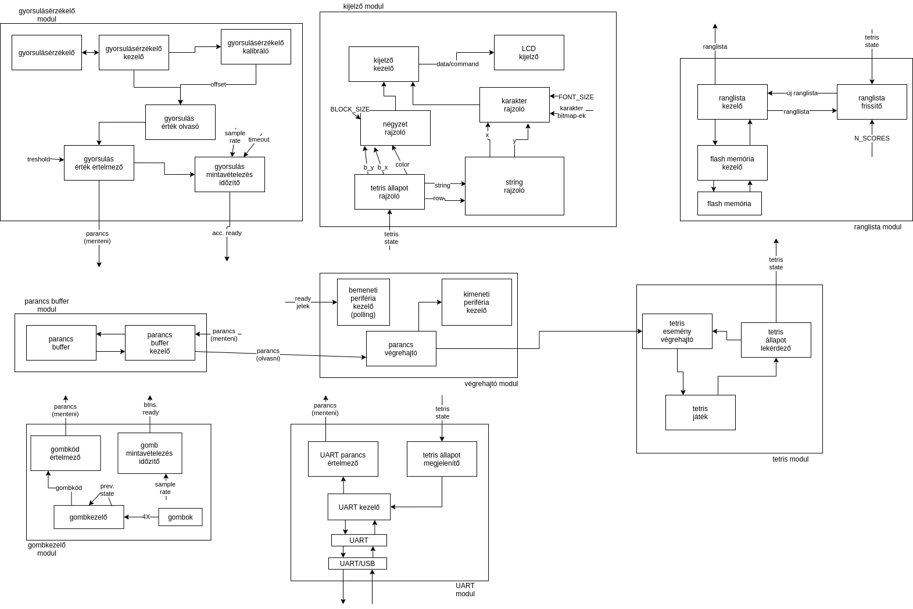
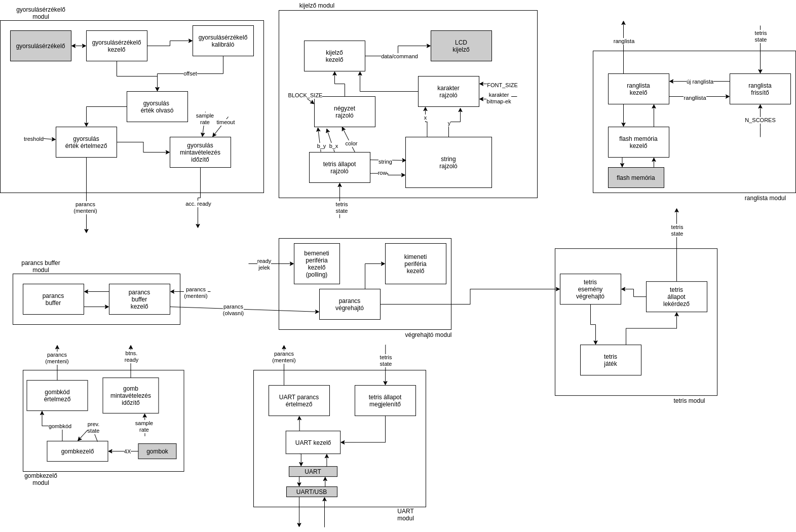
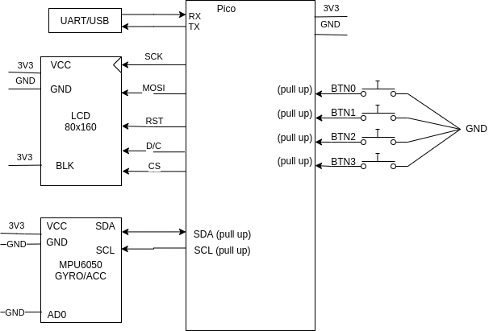
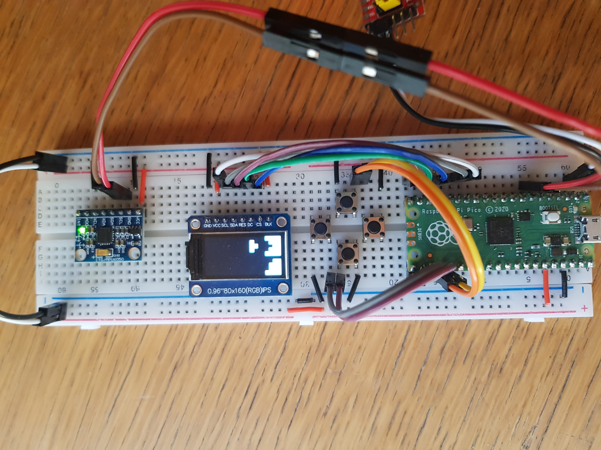
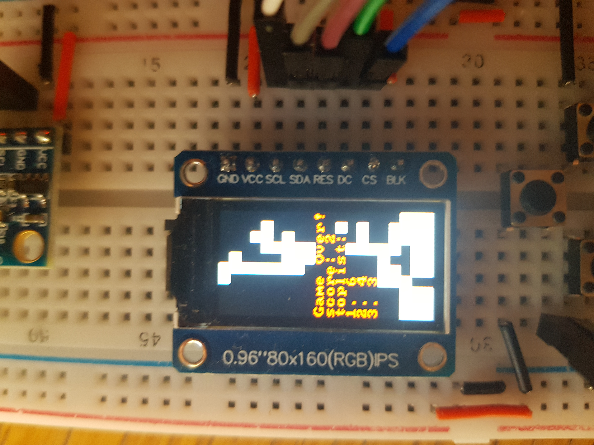

# Tetris

## Felhasznált alkatrészek:

- Raspberry Pi Pico (fejlesztői kártya):
	- Datasheet: <https://datasheets.raspberrypi.org/pico/pico-datasheet.pdf>
	- Pinout: <https://datasheets.raspberrypi.org/pico/Pico-R3-A4-Pinout.pdf>
	- C/C++ SDK dokumentáció: <https://datasheets.raspberrypi.org/pico/raspberry-pi-pico-c-sdk.pdf>

- ST7735S alapú 80x160 pixeles SPI TFT LCD modul:
	- Modul dokumentáció: <http://myosuploads3.banggood.com/products/20190406/201904062255220.96LCD.rar>
	- ST7735S dokumentáció: <https://www.crystalfontz.com/controllers/Sitronix/ST7735S/320>

- MPU-6050 alapú GY-521 modul:
	- MPU-6050 dokumentáció: <http://www.haoyuelectronics.com/Attachment/GY-521/mpu6050.pdf>

- FT232RL USB/UART modul
- 4 darab nyomógomb


## Felhasznált szoftverek:

- Raspberry Pi Pico C/C++ SDK: <https://github.com/raspberrypi/pico-sdk>
- hivatalos Raspberry Pi Pico példaprogramok: <https://github.com/raspberrypi/pico-examples>
- GNU Arm Toolchain: <https://developer.arm.com/tools-and-software/open-source-software/developer-tools/gnu-toolchain/gnu-rm>
- minicom serial kommunikációs szoftwer: <https://salsa.debian.org/minicom-team/minicom>
- 8x8 bitmap betűtípus: <https://github.com/dhepper/font8x8>
- Az LCD modul dokumentációjához tartozó mintaprogramok
- Egyéb, a fejlesztéshez használt szoftverek: make, cmake, ninja, vim


## A játék menete:

Az eszközt (rpi pico) ha megfelelő helyre bedugjuk az usb-csatlakozójával, akkor
egyből elindul a játék. Ez egyrész látható a kijelzőn, másrészt ha pc-hez
csatlakoztatjuk az usb/uart FT232RL modult, akkor a gépen serial kommunikációs
szoftverrel 115200-s baudrate-el látható a szöveges megjelenítés is. A játék a
közismert tetris játékot próbálja imitálni, fentről véletlen választott és
véletlen orientációjú elemek (hivatalos nevükön tetromino-k) hullanak és a
játékos célja ezeket úgy elhelyezni hogy a blokkok egész sorokat töltsenek ki,
mivel a teljes sorok törlődnek, és minden más ami felettük van lejjebb esik
eggyel. A játék célja minnél több ilyen telített sort elérni, mivel a játék
pontszáma abból adódik, hogy hány ilyen telített sort sikerült létrehozni,
törölni. A játék akkor ér véget, mikor az aktuális elem ahogy leérkezik van
olyan blokkja amely kilóg a pályáról. Ekkor a kijelzőn, és a szöveges
kimeneten is láthatóvá válik egy Game Over felirat, az aktuális játékban elért
pontszám, és egy ranglista a legjobb 3 eredményről. Ez után az eszköz vár egy
gombnyomásra, majd újraindul a játék.


## Funkcionális blokkvázlat:



Funkcionalitás alapjás 7 logikailag összetartozó egységre bontottam a feladatot.

- **Gyorsulásérzékelő modul:** A modul magas szintű használata úgy néz ki,
hogy mikor a modul jelzi hogy szabad belőle értéket olvasni, akkor ki lehet
belőle olvasni egy parancsot. Ez úgy működne, hogy akkor jönne létre értelmes
parancs, ha a gyorsulásmérő nyugalmi állapotában történt méréseitől egy adott
határon túl eltérnénk pozitív vagy negatív irányban. A nyugalmi állapot
kijelölése kalibrációval történne, ami úgy működne hogy megállapítanánk
egy offsetet, amelyet a mért értékhez adva 0-t kéne kapnunk. A modulba tartozik
az időzítő amely periodikusan ellenőrzi majd beállítja a mintavételezést
engedélyező jelet, mert ez felhasználja azt hogy ha egy mérés valóban átlépi
az adott tűréshatárt, akkor csak több idő múlva legyen újra engedélyezve a
modul mintavételezése, így elkerülve a hibás méréseket, és ez nagyon elegánsan
megvalósítható úgy, hogy a többi alkotóelemtől teljesen függetlenül működjön.

- **Kijelző modul:** A modulnak magas szinten egy feladata van, hogy
megjelenítse a játék aktuális állapotát. Ez több részből állhat, szükség lehet
szöveg, vagy négyzetek rajzolására. A szövegmegjelenítés-t szét lehet bontani
karakterek megjelenítésére, amihez viszont szükség lesz az adott karakterek
bitmap reprezentációjára. A négyzetek és karakterek rajzolását pedig tehetjük
pixelenként amit a kijelző kezelő le tud bonyolítani parancsok és adatok az
LCD-nek való küldésével.

- **UART modul:** A modulnak magas szinten két feladata van, parancsok
olvasása, és a játék aktuális állapotának megjelenítése szöveges formátumban.
A parancsok olvasása nem bonyolult, csupán szabályokat kell állítani, hogy egy
karakter/karaktersor milyen parancsnak feleljen meg. A játék megjelenítése
pedig egyszerűbb mint a kijelző modulban, így ezt sem kell több részre bontani.

- **Gombkezelő modul:** A modul használata megegyezik a gyorsulásérzékelő
modullal, jelzi ha szabad belőle parancsot olvasni. Ekkor a 4 nyomógomb
állapotát kiolvashatjuk egy gombkódként, majd bevezethetünk szabályokat hogy
melyik gombkód milyen parancsnak felel meg. A gombkezelő megjegyzi a gombok
legutóbbi állapotát, és ebből ki tudja szűrni a meg nem változott gombokat,
és a gombkódban csak az újonnan lenyomott gombok jelennek meg, így elkerüli
a hibás működést. A modul mintavételezésnék engédélyezésénék periodikus
változtatását is ide csoportosíthatjuk, így ez is elegánsan függetleníthető
minden mástól.

- **Parancs buffer modul:** A modulnak két feladata van, beérkező parancsok
tárolása, és parancsok olvasása.

- **Ranglista modul:** A modul feladata hogy megtartsa az adott darab
legsikeresebb játék eredményét. A modulnak két feladata van, hogy ki lehessen
olvasni a ranglista eredményeit és hogy új eredmény lehessen hozzáadni.

- **Tetris modul:** A modul feladata hogy a tetris játék viselkedését
szolgáltassa, azaz le lehessen kérdezni a játék aktuális állapotát, és előre
definiált eseményeket tudjon végrehajtani a játék értelmében, viszont úgy
hogy a játéknak lehetnek olyan állapotai amelyekben nem hajthatók végre
bizonyos események.

- **Végrehajtó modul:** A modul feladata, hogy a parancs bufferből olvasott
parancsokat hajtsa végre, és hogy frissítse a játék állapotát megjelenítő
perifériákat ha ez szükséges. Emellett ez a modul kezeli a ready jelekkel
rendelkező modulok feladatainak végrehajtását.

## Hardver-szoftver szétválasztás:



A feladatnál a harware/software szétválasztás nagyon egyértelmű, az LCD
kijelző, a gyorsulásérzékelő szenzor, a 4 db. nyomógomb, az UART, UART/USB és
a nem felejtő flash memórián kívül mindent meg lehet valósítani szoftverrel.

Összeszámolhatók a portbitek:

- 4 db. a 4 nyomógombhoz.
- 2 db. a gyorsulásérzékelővel történő I2C kommunikációhoz.
- 2 db. az UART/USB átalakítóhoz.
- 5 db. az LCD kijelzővel való egyirányú, bővített SPI kommunikációhoz (SCK,
MOSI, RST, Data/Command, CS).

Tehát összesen 11 darab portbitre lesz szükség.

## Hardver blokkvázlat:



A fejlesztői kártya egy Raspberry Pi Pico, a tápellátást a beépített USB
csatlakozón keresztül kapja, és az UART/USB átalakítón kívül a többi
perfiériának ez szolgál tápellátást. Az UART/USB átalakító szintén saját USB
csatlakozón keresztül kap tápellátást.

## A játék irányítása:

A játékot többféleképpen lehet irányítani:

- Az eszközön találató gombokkal. A gombok egy sarkára állított négyszögben
vannak elhelyezve, így irányokat alapján fogok rájuk hivatkozni. Itt fontos
még megjegyezni, hogy a hosszan letartott gombnyomás egyenértékű a rövid
gombnyomással, azaz a gomb lenyomva tartása nem válja ki az adott esemény
1-nél többször.
	- Balra gomb: az éppen hulló játékelem 1 blokknyival balra mozdul.
	- Jobbra gomb: az éppen hulló játékelem 1 blokknyival jobbra mozdul.
	- Fel gomb: az éppen hulló játékelem óramutató járásával megegyező irányban
	elfordul 90 fokkal.
	- Le gomb: az éppen hulló játékelem óramutató járásával ellenkező irányban
	elfordul 90 fokkal.
	- Fel és Le gomb egyszerre: az éppen hulló játékelem leesik.

- Serial kommunikációs szoftverből, egy karakternyi parancsok használatával.
	- ’h’: az éppen hulló játékelem 1 blokknyival balra mozdul.
	- ’l’: az éppen hulló játékelem 1 blokknyival jobbra mozdul.
	- ’k’: az éppen hulló játékelem óramutató járásával megegyező irányban
	elfordul 90 fokkal.
	- ’j’: az éppen hulló játékelem óramutató járásával ellenkező irányban
	elfordul 90 fokkal.
	- ’d’: az éppen hulló játékelem leesik.
	- ’r’: a gyroszkóp újrakalibrálódik, és a játék újraindul.

- Az eszközön találató gyorsulásmérővel, az eszköz jobbra, balra mozdításával.
A szenzor elég érzékeny, így előfordulhat hogy egy óvatlanabb gombnyomás is
átlépheti az események regisztrálásához fűzött tűréshatárt.
	- Az eszköz balra mozdítása: az éppen hulló játékelem 1 blokknyival balra mozdul.
	- Az eszköz jobbra mozdítása: az éppen hulló játékelem 1 blokknyival jobbra mozdul.

## Az elkészített forráskód:

Megtalálható online is: https://github.com/mhlyv/pico-tetris. A forráskódot
próbáltam logikailag összefüggő elemekre bontani.

### Tetris

Ez a modul adja a tetris játék működését.

**Fájlok:** `tetris.c`, `tetris.h`

**Adatstruktúrák:**
```C
struct Tetris {
	// A Tetris tábla reprezentációja. 1 blokk = 1 bit, byte-onként
	// csoportosítva
	uint8_t board[(BOARD_W * BOARD_H) / 8];

	// Játékelemek (tetrominok) reprezentációjának halmaza.
	// Sorrend: I, O, T, J, L, S, Z.
	// 1 blokk = 1 bit, így az utolsó bit mindig 0 lenne, de ezért
	// az egészet el lehet csúsztatni 1 bittel, a 0.bit azt jelzi
	// hogy a tetromino 3x3 (0) vagy 4x4 (1) méretű. A tetrominok
	// részletesebb reprezentációja a tetris.c/tetris_init funkcóban
	// látható.
	uint16_t tetrominos[N_TETROMINOS];

	// Az aktuális tetrmino indexe a tömbben.
	uint8_t tetromino;

	// Az aktuális tetromino jobb felső sarkának aktuális koordinátái
	// a táblához képest.
	int8_t x;
	int8_t y;

	// Egy flag, hogy kell e frissíteni a táblát mielőtt egyéb lépések
	// hajtódnának végre.
	uint8_t need_update;

	// Az aktuális játék pontszáma.
	uint16_t score;
};
```

**Funkciók:**
```C
// Ez a funkció a könyvtárban nincs implementálva, ez csak egy előre-
// deklaráció. A könyvtár használójának kell implementálni. Egy random
// byte-ot kell előállítania.
uint8_t tetris_random();

// Inicializálja az adott tetris struktúrát.
void tetris_init(struct Tetris *tetris);

// Visszaadja az adott **t** indexű tetromino **(x, y)** koordinátáknál
// található blokkját (egy bitet).
uint8_t tetris_get_tetromino_block(struct Tetris *tetris, uint8_t t, uint8_t x, uint8_t y); 

// Visszaadja az adott **tetris** tábla **(x, y)** koordinátáknál található
// blokkját (egy bitet).
uint8_t tetris_get_raw_board_block(struct Tetris *tetris, uint8_t x, uint8_t y); 

// Visszaadja az adott **tetris** tábla **(x, y)** koordinátáknál található
// blokkját (egy bitet), de úgy mintha az aktuálisan hulló tetromino is
// a tábla eleme lenne.
uint8_t tetris_get_board_block(struct Tetris *tetris, uint8_t x, uint8_t y); 

// Beállítja az adott **tetris** tábla **(x, y)** koordinátáknál található
// blokkját a **val** értékre.
void tetris_set_board_block(struct Tetris *tetris, uint8_t x, uint8_t y, uint8_t val);

// Hogyha az aktuális tetromino kilóg oldalra a táblából, visszatolja.
void tetris_fix_overhang(struct Tetris *tetris);

// Elforgatja az adott **t** indexű tetromino-t 90 fokkal, óramutató járásával
// ellentétes irányban.
void tetris_rotate_tetromino_ccw(struct Tetris *tetris, uint8_t t); 

// Elforgatja az adott **t** indexű tetromino-t 90 fokkal, óramutató járásával
// megegyező irányban.
void tetris_rotate_tetromino_cw(struct Tetris *tetris, uint8_t t); 

// 0-t ad vissza ha az aktuális tetromino nem ütközik alatta lévő blokkba,
// más esetben 1-et ad vissza.
uint8_t tetris_check_overlap(struct Tetris *tetris);

// Ha szabad (a need_update flag nem aktív) akkor elforgatja az aktuális
// tetromino-t 90 fokkal óramutató járásával ellenkező irányba, majd
// javítja a tetromino elhelyezkedését ha az helytelen, aztán ha a tetromino
// *leesett* akkor rámenti a táblára, és bebillenti a need_update-et.
void tetris_rotate_ccw(struct Tetris *tetris);

// Ha szabad (a need_update flag nem aktív) akkor elforgatja az aktuális
// tetromino-t 90 fokkal óramutató járásával megegyező irányba, majd
// javítja a tetromino elhelyezkedését ha az helytelen, aztán ha a tetromino
// *leesett* akkor rámenti a táblára, és bebillenti a need_update-et.
void tetris_rotate_cw(struct Tetris *tetris);

// Ha szabad (a need_update flag nem aktív) akkor eltolja az aktuális
// tetromino-t 1 blokknyival jobbra, majd // javítja a tetromino
// elhelyezkedését ha az helytelen, aztán ha a tetromino *leesett* akkor
// rámenti a táblára, és bebillenti a need_update-et.
void tetris_move_tetromino_right(struct Tetris *tetris);

// Ha szabad (a need_update flag nem aktív) akkor eltolja az aktuális
// tetromino-t 1 blokknyival balra, majd // javítja a tetromino
// elhelyezkedését ha az helytelen, aztán ha a tetromino *leesett* akkor
// rámenti a táblára, és bebillenti a need_update-et.
void tetris_move_tetromino_left(struct Tetris *tetris);

// Beállít egy új, tetszőlegesen választott, tetszóleges helyű, tetszőleges
// elforgatású tetromino-t.
void tetris_set_new_tetromino(struct Tetris *tetris);

// 1-et ad vissza, ha az aktuális tetromino ütközik egy alatta lévő blokkal
// vagy a tábla aljával, különben 0-t ad vissza.
uint8_t tetris_check_collision(struct Tetris *tetris);

// Rámenti az aktuális tetrominot az aktuális helyén a táblára.
void tetris_save_tetromino_to_board(struct Tetris *tetris);

// Törli az **r**-edik sort a táblából, minden felette lévőt eggyel lejjebb
// tol.
void tetris_remove_row(struct Tetris *tetris, uint8_t r); 

// Törli az összes teljes sort a táblából és annak megfelelően növeli a
// pontszámot.
void tetris_remove_full_rows(struct Tetris *tetris);

// 1-et ad vissza, ha a játék véget ért, különben 0-t.
uint8_t tetris_is_game_over(struct Tetris *tetris);

// Frissíti a játékot, 1-et ad vissza, ha a játék véget ért, különben 0-t.
uint8_t tetris_update(struct Tetris *tetris);


// Leejti az aktuális tetrominot.
void tetris_drop(struct Tetris *tetris);
```

### Command Buffer

Ez a modul adja az irányítóparancsok bufferelését.

**Fájlok:** `command_buffer.c`, `command_buffer.h`

**Fontos makrók:**
```C
// parancsbuffer mérete
#define COMMAND_BUFFER_SIZE 16

// a különböző parancsokhoz tartozó karakterek
#define LEFT_CMD 'h'
#define RIGHT_CMD 'l'
#define ROTATE_CW_CMD 'k'
#define ROTATE_CCW_CMD 'j'
#define RESET_CMD 'r'
#define DROP_CMD 'd'
```

A parancsok egy `COMMAND_BUFFER_SIZE` méretű globális, de statikus tömbben
vannak tárolva (`command_buffer`). Ehhez tartozik egy írási (`command_write`)
és olvasási (`command_read`) pointer, amelyek a következő írandó/olvasandó
elemre mutatnak, így lehet elérni körkörös buffer szerű működést. Ezen kívül
van 2 globális de statikus flag (`write_lock/read_lock`) amelyek azt jelzik
hogy a buffer épp olvasva vagy írva van-e. Ezek arra szolgálnak hogy ne
lehessen egyszerre adatot írni és olvasni pl. ha interruptban tennénk ezt.

**Funkciók:**
```C
// Beírja a **command** parancsot a buffer következő helyére, ha a buffer
// éppen nincs olvasva, és parancs ismert, és ha a buffer épp olvasva volt
// akkor *false*-t, különben *true*-t add vissza.
bool command_buffer_write(uint8_t command);

// Kiolvassa a következő parancsot a bufferből, majd visszaadja azt. Ha az
// olvasás sikertelen akkor 0-t ad vissza.
uint8_t command_buffer_read();
```

### Tetris Uart

Ez a modul adja a játékhoz szükséges extra uart funkcionalitásokat.

**Fájlok:** `tetris_uart.c`, `tetris_uart.h`

**Funkciók:**
```C
// Inicializálja, konfigurálja az uart interface-t.
void tetris_uart_init();

// Kiírja a az adott **tetris** tábla szöveges reprezentációját az uart
// interface-re.
void tetris_uart_print(struct Tetris *tetris);

// Parancsokat olvas az uart-ról amíg tud, és ezeket beírja a parancsbufferbe.
void tetris_uart_handle_rx();
```

### Buttons

Ez a modul kezeli a gombokat.

**Fájlok:** `buttons.c`, `buttons.h`

**Globális, de statikus változók:**
```C
// A gombok legutóbbi állapota bitenként tárolva
// bitek:
// 0, 0, 0, 0, bal, le, fel, jobb
static volatile uint8_t button_state = 0;

// Ez a flag biztosítja hogy a gombok csak adott (`BUTTON_SAMPLE_RATE`)
// időközönként legyenek mintavételezve. Értékét a `buttons_ready_callback`
// billenti be az adott ms-enként, majd olvasáskor a buttons_read törli.
// Értékét a `buttons_ready()`-vel lehet lekérdezni.
static volatile bool BUTTONS_READY = false;
```

**Funkciók:**
```C
// Inicializálja a gombokhoz szükséges lábakat, és elindítja a a
// `button_ready_callback` funkció ismétlését adott időközönként, az sdk
// `add_repeating_timer_ms` funkciójával.
void buttons_init();

// Olvassa és visszaadja a gombok állapotát bitenként reprezentálva.
// bitek:
// 0, 0, 0, 0, bal, le, fel, jobb
uint8_t buttons_read();

// Visszaadja a `BUTTONS_READY` flag értékét, azaz hogy lehet-e olvasni a
// gombokat.
bool buttons_ready();

// Callback függvény az sdk repeating_timer struktúráját használva, bebillenti
// a `BUTTONS_READY` flaget.
static bool buttons_ready_callback(struct repeating_timer *t);

// Leolvassa a gombok állapotát, és ha talál ennek megfelelő parancsot, akkor
// az beírja a parancsbufferbe.
void buttons_write_to_buffer();
```

### Gyro

Ez a modul kezeli a gyroszkópot.

**Fájlok:** `gyro.c`, `gyro.h`

**Globális, de statikus változók:**
```C
// Kalibrációs érték, az x tengely irányú gyorsulás 0-tól való eltérése.
// Az értékét `gyro_calibrate_x_acc()` állítja be.
static volatile uint16_t x_acc_offset = 0;

// Azt jelzi hogy még hány mintavételezést kell kihagyni. Ez biztosítja, hogy
// ha egy mérés sikeres volt, azaz a mért érték átlépett egy adott határt,
// akkor az ebből következő utólagos kilengéseket hagyjuk figyelmen kívül.
static volatile uint8_t gyro_skip = 0;

// Flag ami jelzi hogy a gyro-t szabad-e mintavételezni. A
// `gyro_ready_callback()` billenti be `GYRO_SAMPLE_RATE`-enként hogyha a
// `gyro_skip` = 0, különben csak azt csökkenti 1-el.
static volatile bool GYRO_READY = false;
```

**Funkciók:**
```C
// Inicializálja a gyro-hoz szükséges I2C-t, és meghívja a `gyro_reset`-et.
void gyro_init();

// Kezdőállapotba állítja a gyro-t, majd elindítja az sdk
// `add_repeating_timer_ms` funkció segítségével a `gyro_ready_callback`
// ismétlését.
void gyro_reset();

// Visszaadja a `GYRO_READY` értékét, azaz hogy szabad-e olvasni a gyro-t.
bool gyro_is_ready();

// Kiolvassa a gyorsulásmérő 3 irányú adatait az adott helyre.
void gyro_read_acc(int16_t accel[3]);

// Kiolvassa és visszaadja a gyorsulásmérő x irányú adatát.
int16_t gyro_read_x_acc();

// Kiszámítja és beállítja ax `x_acc_offset` értékét.
void gyro_calibrate_x_acc();

// Kiolvassa a gyorsulásmérő x irányú adatát, ezt kompenzálja a kalibrációs
// értékkel, majd ha pozitív vagy negatív irányban átlépi a `GYRO_TRESHOLD`
// értékét akkor az ennek megfelelő parancsot a parancsbufferbe írja, és
// beállítja a `gyro_skip` értékét úgy, hogy a következő `GYRO_TIMEOUT` ms-ben
// ne legyen a gyro mintavételezve.
void gyro_write_to_buffer();

// Bebillenti a `GYRO_READY`-t hogyha a `gyro_skip` = 0, különben csak azt
// csökkenti 1-el.
bool gyro_ready_callback(struct repeating_timer *t);
```

### Display

A kijelző kezelésére szolgáló modul.

**Funkciók:**
```C
// A **data**-t a kijelzőnek küldi.
void display_wr_bus(uint8_t data);

// A **data**-t a kijelzőnek küldi mint adat.
void display_wr_8(uint8_t data);

// A **data**-t a kijelzőnek küldi mint adat. (két részletben)
void display_wr_16(uint16_t data);

// A **cmd**-t a kijelzőnek küldi mint parancs.
void display_wr_cmd(uint8_t cmd);

// Konfigurálja a kijelzővel való kommunikációhoz szükséges spi-t.
void spi_config();

// Inicializálja a kijelzőhöz szükséges lábakat és spi-t, majd konfigurálja
// a kijelzőt a dokumentáció alapján.
void display_init();

// Beállítja az írási ablakot az **((x1, y1), (x2, y2))** négyszögre, így ez
// után ha valaki ír **(x2 - x1) * (y2 - y1)** színt (pixelt) a kijezőre,
// akkor azok itt fognak megjelenni.
void display_set_address(uint16_t x1,uint16_t y1,uint16_t x2,uint16_t y2);

// Az egész kijelzőt végigírja a **color** 16 bites színnel.
void display_clear(uint16_t color);

// Rajzol egy **DISPLAY_BLOCK_SIZE*DISPLAY_BLOCK_SIZE** m méretű négyzetet
// a kijelző **(x, y)** helyére az adott színnel. Itt az x, y, a
// DISPLAY_BLOCK_SIZE skálán van értelmezve.
void display_draw_block(uint8_t x, uint8_t y, uint16_t color);

// Kirajzolja az adott tetris játék állapotát a kijelzőre, fekete alapon
// fehér blokkokkal.
void display_tetris(struct Tetris *tetris);

// Rajzol egy karaktert (**c**) a kijelző **(x, y)** helyére, fekete alapon
// pirossal. Itt az x, y, a `DISPLAY_FONT_SIZE` skálán vannak értelmezve.
void display_draw_char(uint8_t x, uint8_t y, char c);

// Kiíja az **str** stringet a kijelzőre a `DISPLAY_FONT_SIZE` skálán
// értelmezett **row** sorban kezdve, és visszaadja hogy hány sort vett ez
// igénybe. Ha a string nem fér ki egy sorba akkor sortörést alkalmaz.
// (Itt is fekete alapon piros betűk)
uint8_t display_draw_string(const char *str, uint8_t row);
```

### Toplist

Ez a modul kezeli a ranglistát.

**Fájlok:** `toplist.c`, `toplist.h`

**Fontos makrók és konstansok:**
```C
// Hány elemet tárolunk
#define TOPLIST_LENGTH 3

// Hol kezdődjön a rész ahol a ranglistát tároljuk
#define FLASH_TARGET_OFFSET (FLASH_PAGE_SIZE * 1024)

// Pointer az a flash memóriába az adott helyre amit használunk
static const uint8_t *flash_content = (const uint8_t *)(XIP_BASE + FLASH_TARGET_OFFSET);
```

**Funkciók:**
```C
// Kiírja a **scores**-ből az első `TOPLIST_LENGTH` darab pontot a flashbe.
static void toplist_write_scores(uint16_t *scores);

// Lenullázza a toplistát a flash-ben.
void toplist_clear();

// Elhelyezi a **score** pontszámot a toplistában, hogyha elért megfelelő
// helyezést, és a többi pontszámot ennek megfelelően rendezi.
void toplist_add(uint16_t score);

// Kiolvassa és visszaadja az **nth**-edik eredményt a toplistából.
uint16_t toplist_read(uint8_t nth);
```

### Főprogram

A program belépési pontja és főciklusa

**Fájlok:** `main.c`

**Globális, de statikus változók:**
```C
// A tetris játék állapota.
static struct Tetris tetris;

// Flag ami azt jelzi hogy a játékot frissíteni kell-e. Az `update_callback`
// billenti be minden `UPDATE_RATE` ms-enként.
static volatile bool UPDATE = false;

// Flag ami az jelzi hogy vége van-e a játéknak.
static volatile bool GAME_OVER = false;
```

**Funkciók:**
```C
// A tetris modul előre deklarált szükséges függvényének definíciója.
uint8_t tetris_random();

// Beállít egy random seed értéket a ROSC-timer segítségével.
static inline void seed_random_from_rosc();


// Callback függvény amely bebillenti az `UPDATE` flaget. Az sdk
// `add_repeating_timer_ms` funckiójával van `UPDATE_RATE` ms-enként meghívva.
bool update_callback(struct repeating_timer *t);

// Frissíti a játékot:
// - Kiírja a tábla szöveges reprezentációját az uart-ra.
// - Kirajzolja a tábla állapotát a kijelzőre.
// - Meghívja a `tetris_update` funkciót amellyel egyszerre be is billenti
//   a `GAME_OVER` flaget, ha a játék véget ért.
void update();

// Elezdi `UPDATE_RATE` ms-enként meghívni az `update_callback` funkciót az
// sdk `add_repeating_timer_ms` függvény segítségével.
void start_update();


// Befejezi az `update_callback` funkció periodikus meghívását az sdk
// `cancel_repeating_timer` függvényével.
void stop_update();


// A program belépési pontja.
// - Inicializál minden perifériát.
// - Meghívja a	`start_update` függvényt.
// - Elindítja a főciklust:
//     - Kezeli a uart-on érkező parancsokat.
//     - Ha a játéknak vége (`GAME_OVER`):
//         - Megállítja a játék frissítését.
//         - Elmenti a toplistába a játék eredményét.
//         - Kiírja a kijelzőre és az uart-ra azt hogy "Game Over", a játékos
//           eredményét és a toplista eredményeit.
//         - Vár egy gombnyomásig
//         - Újrakalibrálja a gyrot, újraindítja a játékot és annak frissítését.
//     - Különben:
//         - Mintavételezi a gyro-t, ha szabad.
//         - Mintavételezi a gombokat, ha szabad.
//         - Frissíti a játékot, ha szabad.
//         - Végrehajtja a közetkező parancsot a parancsbufferből, ha van ilyen.
int main();
```

## Képek

Több kép itt: <https://drive.google.com/drive/folders/1P2AfxIbcHLrzcfRL1B16QY8YPq1eOylR?usp=sharing>




